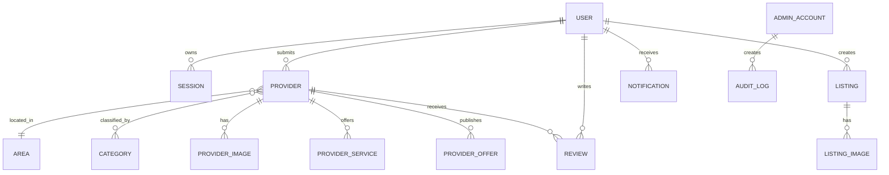

# Database Guide

**Last verified:** 2026-07-24
**Source of truth:** `apps/api/prisma/schema.prisma` and `apps/api/prisma/migrations/`
**Status:** Verified against the Sprint 1.1 isolated PostgreSQL run
**Owner:** Backend/Data Engineering

## Conventions

Prisma is the access layer and PostgreSQL is authoritative. IDs are UUIDs unless the schema declares otherwise. Moderated content uses explicit status fields; archived records are retained rather than silently removed where archive fields exist. The migration `20260724063000_schema_alignment` records fields that were already required by the running API but missing from earlier migration history.

## Models

The following inventory is extracted from the Prisma schema. “Used by” names the main route or workflow rather than every query.

### User
- **Purpose:** End-user identity and profile.
- **Primary key:** `id`.
- **Important fields:** name, email, phone, password hash, provider identity fields, level/points, `isBlocked` and block metadata.
- **Relations:** sessions, verification codes, providers, listings, reviews, favorites, notifications, audit references.
- **Constraints:** email/phone/provider identifiers are guarded by schema and route checks.
- **Used by:** `/api/auth/*`, `/api/me`, admin users.
- **Business rules:** blocked users cannot use existing or new sessions; protected system/admin users cannot be blocked.
- **Risks/notes:** bearer sessions remain the current model; refresh-token rotation is deferred.

### AdminAccount / AdminSession
- **Purpose:** Admin identities and 12-hour admin sessions.
- **Relations:** audit logs and session ownership.
- **Constraints:** `AdminRole` controls route access; API-key mode is an OWNER-equivalent operational path.

### Session / VerificationCode
- **Purpose:** User bearer sessions and OTP/password-reset challenges.
- **Retention:** expired sessions/codes are cleanup candidates; codes are short lived.
- **Security:** only hashed session values are persisted.

### AuditLog
- **Purpose:** Sensitive admin/action history.
- **Important fields:** actor/admin ID, role metadata, action, target, request metadata and timestamp.
- **Used by:** moderation, blocking, lifecycle and settings operations.

### Area
- **Purpose:** Qena locations used for filtering and provider/listing ownership context.
- **Relations:** providers and listings.
- **Constraints:** case-insensitive duplicate names are rejected; referenced areas are deactivated instead of deleted.

### Provider
- **Purpose:** Business/service directory entry.
- **Important fields:** name, description, contact channels, coordinates, status, owner, verification, archive fields, `externalId`.
- **Relations:** images, categories, services, offers, favorites, reports and reviews.
- **Constraints:** public detail is approved-only; owner may inspect own pending record; unique external identity is migration-protected.

### ProviderReport / ProviderImage / ProviderFavorite
- **Purpose:** moderation reports, provider media and user saves.
- **Rules:** local image replacement/deletion removes only safe local files; remote URLs are preserved.

### FavoriteList / SavedSearch
- **Purpose:** user-owned named collections and saved filters.
- **Constraint:** all mutations verify the authenticated owner to prevent IDOR.

### ProviderService / ProviderOffer
- **Purpose:** structured provider services, prices and offers.
- **Moderation:** owner/community submissions follow the provider/content moderation path; admin-authored content is approved directly.

### Category / ProviderCategory
- **Purpose:** directory taxonomy and provider membership.
- **Constraints:** case-insensitive duplicate names; flat taxonomy only. Parent/child relations are not modeled.

### Listing / ListingImage / ListingFavorite / ListingInterest / ListingReport
- **Purpose:** user classifieds/contributions and their media, favorites, interest signals and reports.
- **Lifecycle:** pending/approved/rejected/archived/expired behavior is represented by `ListingStatus` and archive/expiry fields.
- **Ownership:** user mutations compare listing owner ID; admin can moderate lifecycle.

### Review / ReviewHelpful / ReviewReply
- **Purpose:** ratings, helpful reactions and public replies.
- **Moderation:** review status controls visibility; admin can approve/edit/remove.

### Ad / AdReaction
- **Purpose:** sponsored/home campaigns and engagement reactions.
- **Rules:** admin-authored campaigns are directly approved; community submissions require moderation.

### PriceGuide / NowUpdate / NowHelpful / SupportTicket
- **Purpose:** price observations, Qena-now updates, helpful votes and support workflow.
- **Status:** API-backed; external authoritative price/news feeds are not implied.

### DataSource / CollectionJob / CollectedBusiness / DuplicateCandidate
- **Purpose:** data-collection sources, jobs, imported records and duplicate review.
- **Statuses:** `CollectionJobStatus`, `CollectedRecordStatus`, `SocialEnrichmentStatus`.
- **Notes:** OSM path is available; Google Places/social enrichment is feature-flagged and externally configured.

### Notification / PlatformSettings
- **Purpose:** in-app notifications and admin-controlled runtime settings.
- **Notification rules:** `readAt`, `targetType` and `targetId` support read/unread and deep-link behavior. Push delivery is not implemented in the API.

## Simplified ERD

## Migration history summary

- Initial migrations create the core directory, identity, listings, reviews, ads and settings tables.
- `20260724060000_production_stabilization` adds block state and related security fields.
- `20260724063000_schema_alignment` adds archive/contact/social/opening-hours/external identity fields and indexes required by current code.
- Sprint 1.1 verified all committed migrations on isolated test and staging databases; existing rows were preserved.

## Sensitive/retention tables

Treat `User`, `AdminAccount`, `Session`, `VerificationCode`, `AuditLog`, support tickets and media references as sensitive. Expired sessions/codes and unreferenced local files need scheduled cleanup. Backups must be encrypted and access-controlled.

## Known schema limitations and future notes

- No access/refresh token pair or token-family table yet.
- No category parent/child relation or audited merge table.
- Local media URLs are stored in relational rows; object storage is not active.
- Any future destructive migration must first run duplicate/reference checks and restore testing.

## مين شاطر

The additive migration `20260724194542_min_shater` adds `MinShaterRequest`, `MinShaterRecommendation`, `MinShaterHelpful`, and `MinShaterReport`. Requests and recommendations use existing `ReviewStatus` moderation values, soft-delete/archive timestamps, active taxonomy references, and indexes for moderation, ownership, pagination and lookup. Helpful has a composite uniqueness key; reports support one pending report per user/target at the service layer.

The additive migration `20260724220619_price_confirmations` adds `PriceConfirmation`, uniquely scoped to `(priceGuideId, userId)`. It stores whether a user still considers an approved price valid, an optional note and timestamps without overwriting the original price observation.
