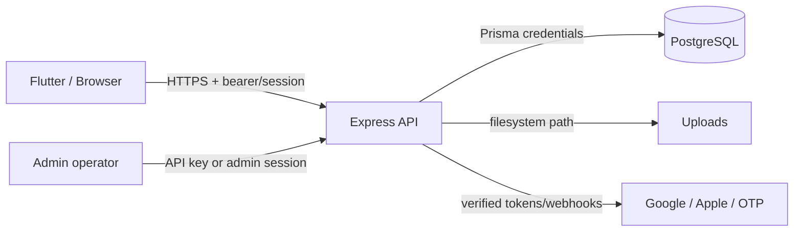

# Security Model

**Last verified:** 2026-07-24
**Source of truth:** `apps/api/src/server.ts`, Prisma schema, Sprint 1/1.1 tests
**Status:** Verified for implemented controls; external OAuth/device flows are Unverified
**Owner:** Engineering/Security

## Trust boundaries

The client is untrusted. Authorization is enforced in the API, not only in Flutter or Next.js. PostgreSQL and the upload root are trusted infrastructure but must be permission-restricted.

## Authentication

- Passwords are hashed; sessions are stored as hashes and expire after 30 days.
- Federated Google/Apple tokens are verified for signature, issuer and configured audience before a session is issued.
- Email collisions across federated identities return 409; accounts are not silently merged.
- Blocked users are rejected at session resolution and login.
- Admin sessions are separate and expire after 12 hours.
- Logout deletes the current session; logout-all revokes user sessions.

## Authorization and IDOR controls

- Admin routes use API-key or admin-session authentication plus role checks.
- Provider, listing, review, favorite-list and contribution mutations compare resource ownership to the authenticated user.
- Public provider detail hides non-approved records; an owner exception is limited to that owner.
- System/admin accounts cannot be blocked through the user-block route.
- Sensitive admin mutations write `AuditLog` metadata with actor ID and role.

## Upload security

- Decode bytes and verify JPEG/PNG/WebP magic bytes; MIME declarations are not trusted.
- Limit each image to 2 MiB and JSON bodies to 24 MiB.
- Generate safe random names; reject path traversal and disallowed destinations.
- Replacement/deletion only removes local URLs under the configured API origin and upload directories.
- Remote URLs are never removed by local cleanup.

## Data integrity

- Case-insensitive duplicate checks protect categories and areas.
- Referenced taxonomy records are deactivated rather than deleted.
- Prisma migrations are append-only; the schema-alignment migration is additive.
- Backups/restores must use a separate target database for verification.

## Threat model and operational controls

| Threat | Current control | Remaining risk |
|---|---|---|
| Stolen bearer session | Hash at rest, expiry, logout | No rotating access/refresh tokens yet |
| IDOR | Ownership checks in API | New routes need regression tests |
| Malicious image | Magic-byte and size checks | No antivirus/content moderation service |
| Admin key leakage | Secret env + audit | API-key mode is powerful; rotate/limit access |
| Path traversal | Generated names and local-root checks | Keep upload root outside source tree |
| OAuth misconfiguration | Issuer/audience validation | Physical-device production verification pending |
| Data loss | Backups and separate restore test | Retention/encryption policy is operational |

## Deferred security design

Access/refresh-token rotation is intentionally not implemented in this sprint. A later migration should introduce short-lived access tokens, rotating refresh-token families, replay detection, revocation and a dual-read client rollout. Category hierarchy is likewise deferred; see [Database Guide](./DATABASE_GUIDE.md).

## Security review checklist

Before release: use HTTPS, rotate secrets, restrict CORS, run integration tests on isolated PostgreSQL, verify admin role boundaries, test image replacement/deletion, inspect audit logs, restore a backup, and complete physical Google/Apple checks.
