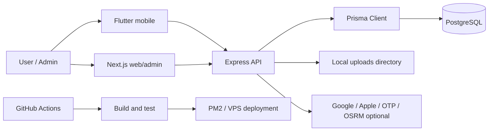
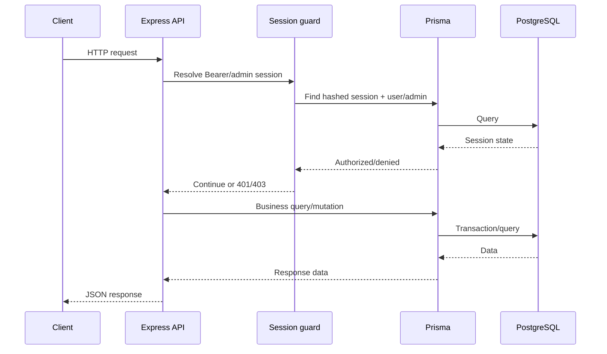
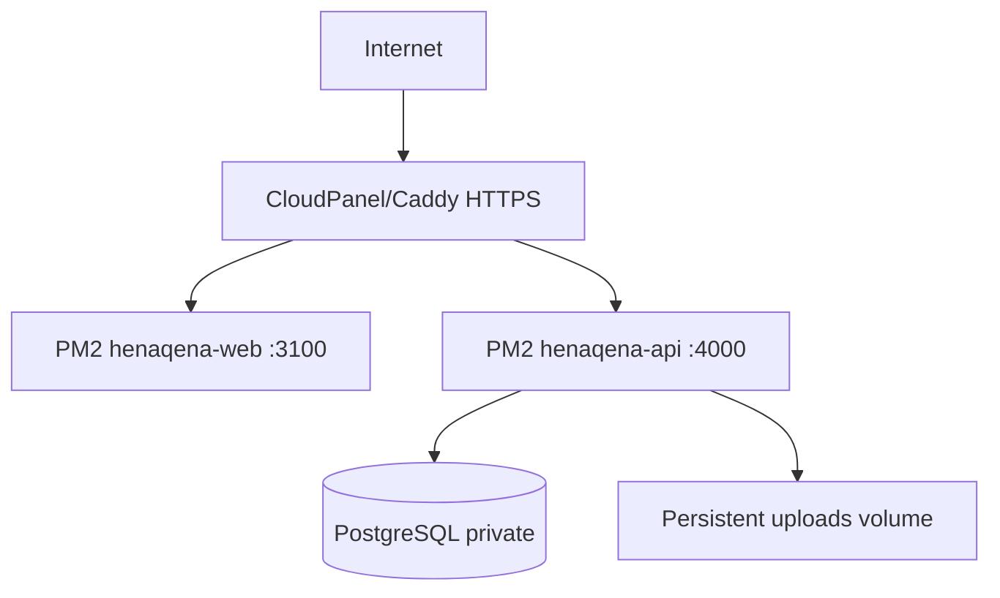

# System Architecture

**Last verified:** 2026-07-24
**Source of truth:** `apps/api/src/server.ts`, `apps/api/prisma/schema.prisma`, `apps/web/app`, `apps/mobile/lib`
**Status:** Verified (runtime behavior is verified by Sprint 1.1 integration tests; external identity providers remain unverified)
**Owner:** Engineering; update when an entry point, boundary, or deployment contract changes.

## Overview

Hena Qena is a local-services application. The Flutter mobile app and the Next.js web/admin application call one Node.js/Express API. The API uses Prisma to access PostgreSQL and stores local media under an uploads directory. The production process layout uses PM2: `henaqena-api` on port 4000 and `henaqena-web` on port 3100. A reverse proxy exposes the web domain and keeps PostgreSQL private.

The repository does **not** contain a NestJS service; the backend is Express (`apps/api/src/server.ts`). `apps/api/src/app.ts` is a smaller legacy/test application and is not the production entry point.

## Components

| Component | Entry point | Responsibility | Status |
|---|---|---|---|
| Flutter mobile | `apps/mobile/lib/main.dart` | User onboarding, directory, maps, contributions, reviews, favorites and account UI | Implemented/Partial by feature; see [Feature Status](./FEATURE_STATUS.md) |
| Node API | `apps/api/src/server.ts` | HTTP API, auth, authorization, moderation, uploads, jobs and backups | Implemented |
| Prisma | `apps/api/prisma/schema.prisma` | Typed database access and migrations | Implemented |
| PostgreSQL | `DATABASE_URL` | Durable application and control-plane data | Implemented |
| Next.js web/admin | `apps/web/app` | Public web routes and administration screens | Implemented/Partial by screen |
| Local media | `UPLOADS_DIR` and `/uploads/*` | Provider, listing and avatar files | Implemented; object storage is planned |
| CI/CD | `.github/workflows/ci.yml`, `deploy.sh`, `infra/ecosystem.config.cjs` | Validation, build and PM2 deployment | Implemented; remote CI run remains unverified |

## System context

## Request lifecycle

1. Client sends JSON with an optional `Authorization: Bearer <session>` header.
2. Express applies CORS, security headers, JSON body limits and static `/uploads` handling.
3. Route-level Zod validation parses the body/query.
4. `sessionFromRequest` or `adminSessionFromRequest` loads a hashed session from PostgreSQL and rejects expiry/inactive/blocked accounts.
5. Owner/admin guards enforce role or ownership.
6. Route performs Prisma reads/writes and emits `AuditLog` entries for sensitive admin actions.
7. Errors are normalized to JSON status codes; Zod input errors are 400 and authorization failures are 401/403.

## Authentication and authorization

- Password registration/login issues a hashed 30-day `Session` bearer token.
- Federated login verifies Google/Apple identity tokens against configured audiences and issuers, then issues the same session type.
- Admin login issues a separate 12-hour `AdminSession`.
- `requireAdmin` accepts an `x-admin-key` (OWNER-equivalent) or an active admin session.
- `requireAdminRoles` additionally checks `OWNER`, `MODERATOR`, `REVIEWER`, or `CONTENT_EDITOR` as declared by the route.
- User sessions are rejected when expired or when `User.isBlocked` is true.
- Ownership routes compare the stored owner ID with the authenticated user ID.

Refresh-token rotation is not implemented; this is documented security debt, not a hidden capability.

## Media upload flow

1. Client uploads base64 image payloads to `/api/uploads/provider-images` or `/api/uploads/avatar`.
2. API validates Zod MIME declaration, decodes bytes, checks JPEG/PNG/WebP magic bytes, and enforces a 2 MiB per-image limit.
3. Server writes a random safe filename under `providers`, `avatars`, or `listings`.
4. The returned URL is attached to a provider/listing/user record.
5. Replacements and deletions remove only local URLs belonging to the configured API origin.
6. Lifecycle cleanup removes unreferenced local files older than 24 hours; remote URLs are ignored.

## Admin moderation flow

Admin list/review routes load pending content, and moderation mutations set `ReviewStatus` or lifecycle fields, notify owners when relevant, and write audit metadata. Admin-created ads/content are approved directly by the route. Community submissions remain pending until moderation.

## Provider/business ownership flow

Users can create providers as community submissions. A provider has an optional `ownerId`; owner mutation routes require that exact user. Public provider detail requires `APPROVED`, while the owner may inspect their own pending provider. Admin detail edits can replace all provider metadata, categories and images.

## Notifications flow

Notifications are rows in `Notification` addressed to a user. Read operations update `readAt`; `read-all` updates all unread rows. Moderation and lifecycle routes create targeted notifications with `targetType` and `targetId`. Push delivery itself is not implemented in the API; the mobile client currently consumes API data.

## Search flow

The API provides provider/listing/category/area query endpoints and the mobile client performs the user-facing search/filter experience. External social enrichment is optional and disabled by default. Google Custom Search is not a guaranteed production dependency.

## Deployment topology

`infra/ecosystem.config.cjs` defines the PM2 processes. `infra/Caddyfile` is an optional proxy configuration. The VPS may instead use CloudPanel’s own reverse proxy.

## Architectural constraints and technical debt

- Single bearer session instead of access/refresh token rotation.
- Local filesystem media is not horizontally scalable; S3/R2 is planned.
- Categories are flat; parent/child relations are not modeled.
- API and admin authorization rely partly on a powerful API key; key rotation is operational.
- Admin UI and public web are in one Next.js application.
- `apps/api/src/app.ts` duplicates a small legacy API surface used by old tests; production uses `server.ts`.
- External Google/Apple/OTP integrations need live credentials and physical-device verification.

## Related documents

- [Database Guide](./DATABASE_GUIDE.md)
- [API Reference](./API_REFERENCE.md)
- [Security Model](./SECURITY_MODEL.md)
- [Deployment Guide](./DEPLOYMENT_GUIDE.md)
- [Project Structure](./PROJECT_STRUCTURE.md)
- [Feature Status](./FEATURE_STATUS.md)
